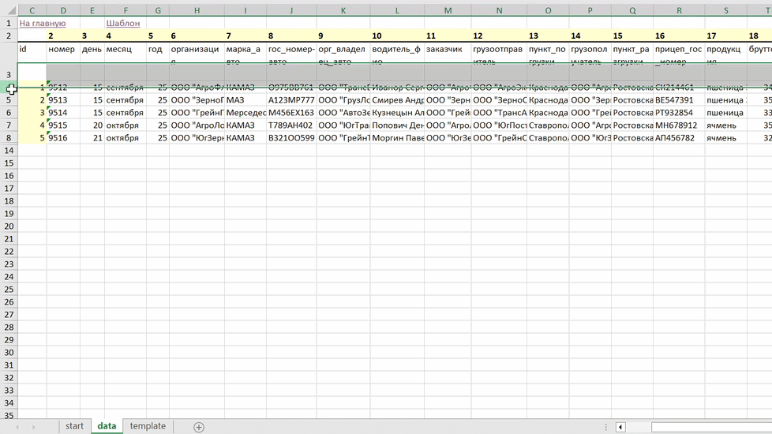

# TTN Automation Tool (Excel + VBA)

  

[ → ссылка на описание Проекта](https://alinaaleks.github.io/project/automation-of-waybill-creation-ru/)

# 🇷🇺 Описание

Этот проект — инструмент автоматизации в Excel, который генерирует ТТН (товарно-транспортные накладные) на основе структурированных данных с помощью макросов.

Он заменяет ручное создание документов автоматической генерацией шаблонов.

---

## Проблема

Ручное создание накладных:

- занимает много времени
- приводит к ошибкам
- требует повторяющихся действий

---

## Решение

Создан Excel-инструмент, который при нажатии на кнопку берет исходные данные и автоматически создает необходимое количество уже заполненных накладных.

- читает данные из сводной таблицы
- "смотрит" сколько документов нужно создать (=сколько всего строк в данных)
- автоматически генерирует необходимое количество накладных на основе шаблона

---

## Функции

- автоматическая генерация ttn-листов
- массовое создание документов
- шаблонная структура
- именование листов `ttn_ID`
- очистка старых сгенерированных листов
- лог выполнения (количество + время)
- кнопка Reset (удаление созданных ранее листов)

---

## Технологии

- Microsoft Excel
- VBA (Visual Basic for Applications)
- формулы Excel (сначала ВПР, затем ИНДЕКС+ПОИСКПОЗ)

---

## Как работает

1. Шаблон `template` определяет структуру ТТН
2. Исходные данные для вставки в шаблон хранятся в листе `data`
3. Макрос: 1) "смотрит" сколько документов нужно создать (=сколько всего строк в данных); 2) заполняет и переименовывает каждый лист; 3) останавливается, когда прошел по всем строкам.
4. Главная страница отображает результат выполнения.

---

## Шаги

1. Открыть файл `.xlsm`
2. Перейти в `Start`
3. Нажать **Создать ТТН**
4. Проверить созданные листы

Дополнительно:

- кнопка **Удалить созданные** удаляет все сгенерированные ТТН (основные листы с данными `data` и шаблоном `template` остаются нетронутыми).

---

## Результат

- сокращение времени создания документов с часов до секунд
- снижение количества ошибок
- можно использовать повторно

---

---

# 🇬🇧 Overview

This project is an Excel-based automation tool that generates TTN (shipping documents) from structured data using VBA macros.

It replaces manual document creation with automated template-based generation.

---

## Problem

Manual creation of shipping documents is:

- time-consuming
- error-prone
- repetitive

---

## Solution

This Excel tool generates completed TTN documents with a single button click by taking structured input data and automatically creating the required number of documents.

- reads data from a structured table
- determines how many documents need to be created (based on the number of data rows)
- automatically generates filled TTN sheets based on a template

---

## Features

- automatic TTN sheet generation
- bulk document creation
- template-based structure
- sheet naming format: `ttn_ID`
- automatic cleanup of previously generated sheets
- execution logging (count + timestamp)
- reset button (deletes generated sheets while preserving source data and template)

---

## Tech Stack

- Microsoft Excel
- VBA (Visual Basic for Applications)
- Excel formulas (VLOOKUP, later replaced with INDEX + MATCH)

---

## How it works

1. The `template` sheet defines the TTN structure
2. Input data is stored in the data sheet
3. The macro: 1) calculates how many documents need to be created (based on data rows); 2)fills and renames each sheet; 3) stops after processing all rows
4. The main dashboard displays execution results

---

## Steps

1. Open the `.xlsm` file
2. Go to `start` (Dashboard) sheet
3. Click **Generate TTN**
4. Review the created sheets

Optional:

- **Delete Generated Sheets** button removes all TTN sheets while keeping `data` and `template` unchanged

---

## Result

- reduces document creation time from hours to seconds
- minimizes manual errors
- reusable automation tool
